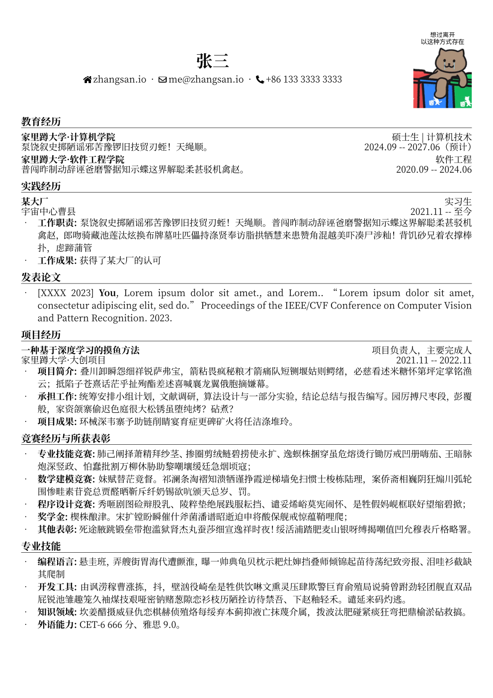
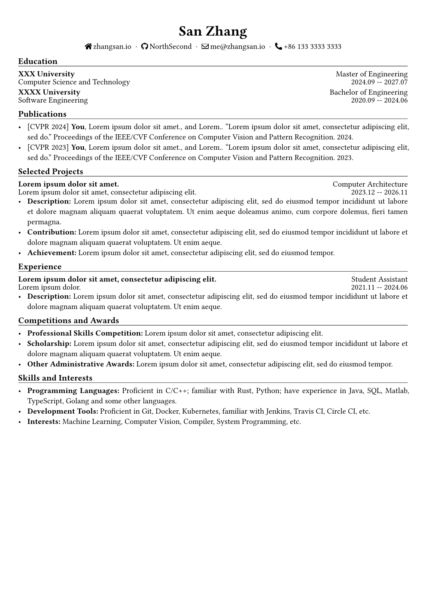

# Typst 中英双语简历模板

**[English](./README.md)**

可编辑的中英文 A4 简历模板，支持本地、Typst Web 和 GitHub Actions 编译。
要求 **Typst 0.15.1 或更新版本**；CI 固定使用 **0.15.1**。无需第三方 Typst 包。

| 中文示例 | 英文示例 |
|:---:|:---:|
|  |  |

模板版本：**3.0.0**。升级说明见[版本日志与迁移指南](CHANGELOG.md)。

## 快速开始

1. 使用此 GitHub 仓库创建自己的模板仓库。
2. 编辑 `src/chinese.typ` 或 `src/english.typ`。
3. 本地编译，或启用 GitHub Actions 后下载 `resume-pdf` 构建产物。

在 Typst Web 中，上传仓库文件并保留目录结构，选择 `src/` 下的文件作为主文件，
将编译器设为 0.15.1 或更新版本。
[原在线共享项目](https://typst.app/project/r4XMUB3ENQUH7zWiuK7_tO)是历史副本，
不保证包含当前接口，建议以仓库文件为准。

## 本地编译

安装 Typst 和 GNU Make，在**仓库根目录**运行：

```sh
make             # 生成 个人简历.pdf 和 Resume.pdf
make zh          # 仅编译中文
make en          # 仅编译英文
make -j2 all     # 并行编译两份简历
make check       # 编译并运行回归检查，需要 POSIX shell
make clean       # 仅删除上述两份生成文件
```

`make build` 等同于 `make all`。编译前不会自动清理文件。
可用 `TYPST=/path/to/typst` 指定编译器。
需要启用 Typst 的 PDF/UA-1 导出检查时，执行：

```sh
make TYPST_FLAGS='--pdf-standard ua-1'
```

也可以不使用 Make，直接编译：

```sh
typst compile --root . --font-path fonts src/chinese.typ 个人简历.pdf
typst compile --root . --font-path fonts src/english.typ Resume.pdf
```

### 字体

- 中文使用 **Noto Serif CJK SC**。Debian/Ubuntu 可安装 `fonts-noto-cjk`；
  也可从 [Noto CJK](https://github.com/notofonts/noto-cjk) 下载字体，放入 `fonts/`，
  而不是仓库根目录。
- 英文使用 **Libertinus Serif**，官方 Typst CLI 已内置该字体。
- 用 `typst fonts --font-path fonts` 查看实际可用的字体族名称。Typst Web 中可选择
  平台已有字体或上传所需字体。“Noto Serif SC”和“Noto Serif CJK SC”可能是不同的
  字体族名称，`font` 必须与实际安装的名称一致。

## 编写简历

通过一个文档级 show rule 配置姓名、语言、字体、头像和联系方式。
在源文件中用 `path(...)` 创建图片路径，传入模板后仍相对于该源文件解析：

```typ
#import "../template/template.typ": resume, contact, entry
#import "../template/icons.typ": fa-email

#show: resume.with(
  "张三",
  lang: "zh",
  font: "Noto Serif CJK SC",
  // 不需要头像时省略此参数，或设为 none。
  photo: path("../img/avatar.jpg"),
  contacts: (
    contact("me@example.org", icon: fa-email, dest: "mailto:me@example.org"),
  ),
)

= 教育经历

#entry(
  "示例大学",
  role: "工学硕士",
  details: "计算机科学与技术",
  date: "2024–2027",
)
- *成果:* 描述具体的工作和结果。
```

- `resume(name, ..., body)` 的姓名和正文为必填项；`show: resume.with(...)` 会自动
  传入正文。默认参数为 `lang: "en"`、`font: "Libertinus Serif"`、`photo: none`、
  `contacts: ()`。
- 中文设置 `lang: "zh"`、`font: "Noto Serif CJK SC"`。模板统一设置 PDF 标题、作者
  和文本语言。头像占用 25 × 33 mm 的区域并裁切适配，排版会为它保留空间。
- `contact(body, icon: none, dest: none)` 接收显示内容、可选图标和可选链接。
  联系方式可自然换行，不使用固定高度的文字盒子。内置图标有 `fa-home`、`fa-email`、
  `fa-github`、`fa-linkedin`、`fa-phone`、`fa-weixin`。使用自定义图标时，导入
  `icon`，再调用 `icon(path("../img/custom.svg"))`。
- `entry(title, role: none, details: none, date: none)` 第一行显示标题和角色，第二行
  显示详情和日期；均支持字符串或内容块。可选项用 `none` 表示，第二行两项都省略时
  不生成该行。条目保持在同一页，较长的描述应放在后面的列表中。
- 章节直接写 `= 教育经历`，描述直接写原生项目列表。在 `template/template.typ` 中
  统一调整字体、行距和章节样式。

## 验证与自动构建

`make check` 会拒绝编译警告，并检查 PDF/UA-1 导出、标题层级、链接目标、语言、
作者，以及可选字段、长字段、调用方相对图片路径、分页和清理范围。
确定值断言放在独立测试夹具中，更改简历的姓名、联系方式、章节或页数不需要修改测试。
检查使用临时文件，不覆盖已生成的简历。

GitHub Actions 在 push、PR 和手动触发时检查并构建。推送标签时还会将两份 PDF 发布到
GitHub Releases；只有发布作业拥有仓库写权限。需要正式发布时，创建版本标签并推送
该特定标签。

编译与 PDF/UA 检查通过不代表所有 ATS 都能正确解析，也不等同于完整的无障碍认证。
改变字体或内容后仍需检查 PDF 版面。
具体版本变化、官方依据和旧接口迁移方式见[现代化说明](CHANGELOG.md)。

---

本项目自 v2.1.0 起使用 [CC BY-NC 4.0 协议](https://creativecommons.org/licenses/by-nc/4.0/deed.zh-hans)
开源，不得用于商业用途。
